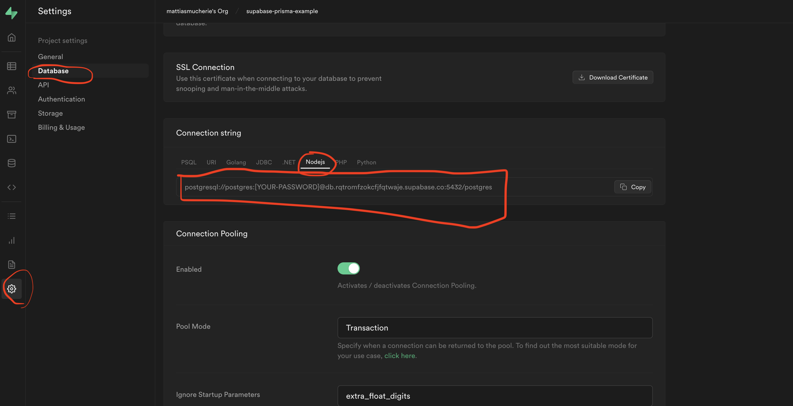
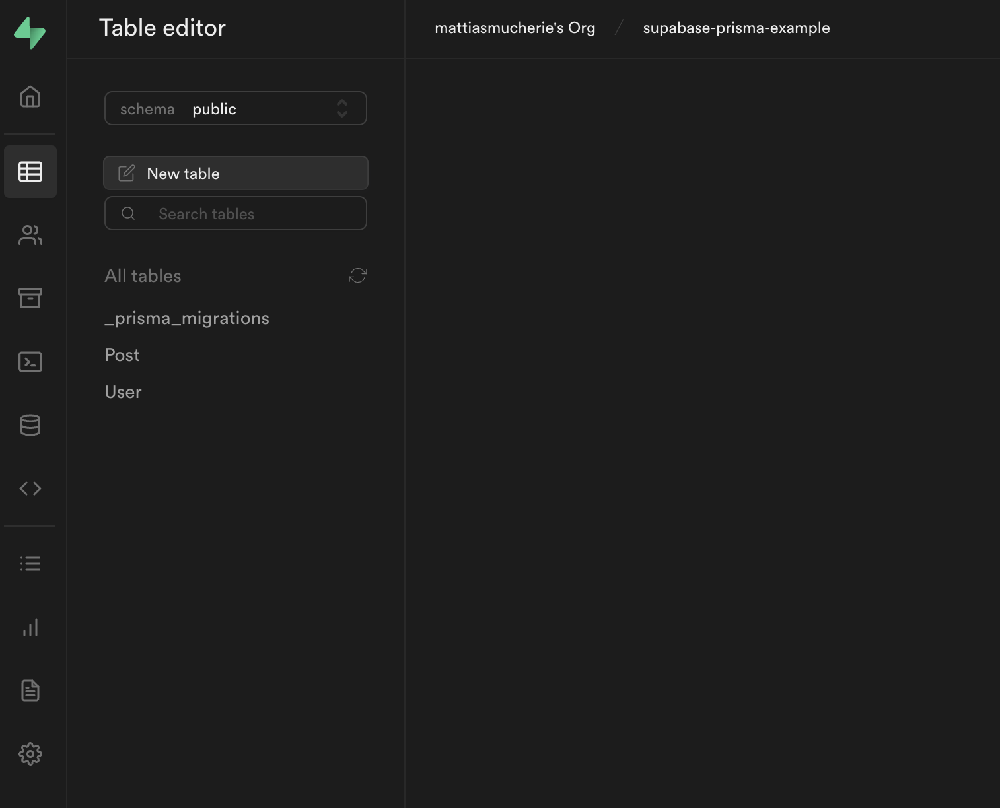

## Supabase

Supabase is an alternative to Firebase. On Supabase we can host an Database and many more things like storing images etc...
We will only go thought how to read and write to the Database.

### Account

You need an account on supabase so go to [supabase.io](https://supabase.io) and click on `Sign in` in the top right corner.

After having an account, you need to start a project by clicking on `New Project`

Give that project a name and add a database password. **Save this password, we will need it later**

[//]: # "iROmcYgMV2fkJUGd"

Select a region that fits your need and stick with the free plan.

Then, click on `Create new project`.
This will take a couple of minutes so we can turn our attention to our Next.js project.

## Next

I will use `Next.js` in this example but this could also work in an Express application or similar.

### Installing packages

We will need to install some packages in our project

```shell
yarn add prisma -D
```

```shell
yarn add @prisma/client
```

After installing the libraries, we can initiate prisma enter in our console

```shell
npx prisma init
```

We then get a bunch of instructions in our terminal

```
Next steps:
1. Set the DATABASE_URL in the .env file to point to your existing database. If your database has no tables yet, read https://pris.ly/d/getting-started
2. Set the provider of the datasource block in schema.prisma to match your database: postgresql, mysql, sqlite, sqlserver, mongodb or cockroachdb.
3. Run yarn prisma db pull to turn your database schema into a Prisma schema.
4. Run yarn prisma generate to generate the Prisma Client. You can then start querying your database.
```

We also so a new folder that has been generated called `/prisma`.

In this folder we have a file called `schema.prisma`.
It is in here we will model our database and do some setup.

You will also notice that we now have a `.env` file with a variable called `DATABASE_URL`

We will find that variable in our **Supabase settings**. Go to Settings->Database->Connection String -> Nodejs

We will replace our variable `DATABASE_URL` with what we found in the Supabase settings.

In the `schema.prisma` file, we do not need to change anything yet.



## Models (Tables)

Currently, we have a Database hosted on Supabase, and we are ready to connect to it with our Next application.

We then need to start building our tables.
We do that with the help of defining `Models`.
You will see a lot of similarities with how we will define models and how we defined tables during the week.

So, in our file called `schema.prisma`, under the `datasource` object, we will define two models: `User` and `Post`

```prisma
model User {
  id    Int     @id @default(autoincrement())
  email String  @unique
  name  String?
  posts Post[]
}

model Post {
  id        Int     @id @default(autoincrement())
  title     String
  content   String?
  published Boolean @default(false)
  author    User    @relation(fields: [authorId], references: [id])
  authorId  Int
}
```

You can read more on how to define the models and all the different types in their [docs](https://www.prisma.io/docs/)

We are now ready to map our models to the database schema.

```shell
npx prisma migrate dev --name init
```

You should now see that we have two table, `Post` and `User` tables in **Supabase**.


[//]: # "9UCmHOo1xwm4shrL"
